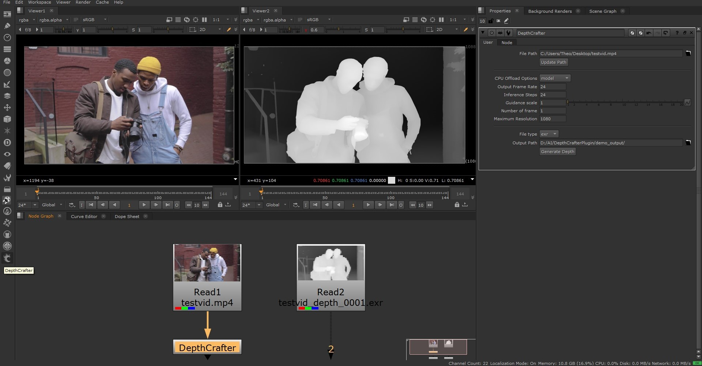
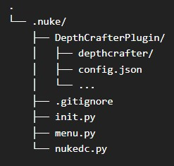

## ___***DepthCrafter for Nuke***___
<div align="center">

[Depthcrafter by TENCENT](https://github.com/Tencent/DepthCrafter)
<br><br>
Adapted for Nuke by 
<br><br>
[Theo SAMINADIN](https://github.com/Theo-SAMINADIN-td)

</div>
 <br><br>

DepthCrafter for Nuke allows you to generate temporally consistent Depth sequences inside Nuke. See more examples [here](https://github.com/Tencent/DepthCrafter?tab=readme-ov-file#-visualization)

<div style="display: flex;">
  
  <br><br>
</div>


https://github.com/user-attachments/assets/9414b4e5-d731-4d60-bf90-3f574fe03a24


## 💡 Extra features

- Support ImgtoImg, ImgtoVid, VidtoVid, VidtoImg
- EXR Sequence export
- DepthCrafter node


## 🗒️ Requirements
According to [Nuke v15 Third-Party Libraries and Fonts](https://learn.foundry.com/nuke/content/misc/studio_third_party_libraries.html)

- Nuke 15 or higher (not tested on previous versions)
- [Python 3.10.10](https://www.python.org/downloads/release/python-31010/)
<br><br>
## 🛠️ Installation
### 1. Clone this repo into your .nuke (by default C:\Users\\%UserProfile%\\.nuke) :
```bash
git clone https://github.com/Theo-SAMINADIN-td/NukeDepthCrafter.git
```
Or Download this repo as [ZIP file](https://github.com/Theo-SAMINADIN-td/NukeDepthCrafter/archive/refs/heads/main.zip) and extract it in your .nuke
<br><br>

Your tree should look like that
<br><br>
<div style="display: flex;">
  
  <br><br>
</div>

### 2. Download the [Model from Tencent HF page](https://huggingface.co/tencent/DepthCrafter/blob/main/diffusion_pytorch_model.safetensors) and put it in .nuke\DepthCrafterPlugin


### 3. Install Dependencies:

#### A. Checking Python version
<br> Open your Command Prompt and type ```Python``` and hit Enter. 
<br>If your python version is 3.10.10 go to [next step](https://github.com/Theo-SAMINADIN-td/NukeDepthCrafter?tab=readme-ov-file#b-environment-choices). If it's not, Go to the System Environment Variables in your start menu > Environment Variables > "Path" Variable > hit "Edit".
<br><br>If you see the paths to Python310 & Python310/Script, move them to the top. Go to the [next step](https://github.com/Theo-SAMINADIN-td/NukeDepthCrafter?tab=readme-ov-file#b-environment-choices)

<br><br>If you don't see them, 
- Option 1: Install or reinstall [Python 3.10.10](https://www.python.org/downloads/release/python-31010/) with "Add Python to environment variables" checked. You should now see in Environment Variables, Paths to Python310.

- Option 2: Add paths manually. Check where Python is installed. Python is typically installed at ```"C:\Users\%UserProfile%\AppData\Local\Programs\Python\Python310"```
  <br>Copy your path and add the two Python paths, click on "New": first ```"path\to\Python310"```, second ```"path\to\Python310\Scripts"```. Move them both to the top.


<br>Last check, open your Command Prompt then type ```Python``` and hit enter. You should have the right Python version, 3.10.10
<br><br> 
#### B. Environment choices
- Option 1: Create a virtual environment (recommended)
<br>Create a folder where you want and copy its path.
In the Command Prompt type: ```python -m venv /path/to/new/virtual/environment``` then ```/path/to/new/virtual/environment/Scripts/activate.bat``` the name of your VENV should appears on the left. Go to the [next step](https://github.com/Theo-SAMINADIN-td/NukeDepthCrafter?tab=readme-ov-file#c-dependencies-installation)

- Option 2: Working directly in a Python Environment.
  Go to the [next step](https://github.com/Theo-SAMINADIN-td/NukeDepthCrafter?tab=readme-ov-file#c-dependencies-installation)
<br><br>
#### C. Dependencies installation
<br>
<br>
<br>
Pytorch/Cuda and xformers

```bash
pip install torch==2.0.1+cu118 --index-url https://download.pytorch.org/whl/cu118
```
Then
```bash
pip install -r path/to/.nuke/DepthCrafterPlugin/requirements.txt
```
Referring to [requirements.txt](https://github.com/Theo-SAMINADIN-td/NukeDepthCrafter/blob/main/DepthCrafterPlugin/requirements.txt)
<br><br>
### 4. Set your Nuke files: 

In init.py, add your path to where you installed the dependencies.
<br><br>
If you are working in a Virtual Environment, add ```nuke.pluginAddPath(r"path/to/your/venv/Lib/site-packages")``` 
<br>
</br>
If you are working in a Python Environment, add ```nuke.pluginAddPath(r"path/to/Python310/Lib/site-packages")``` 

<br></br>
***❗If your .nuke folder path that is not C:\Users\\%UserProfile%\\.nuke, please change the [unet_path](https://github.com/Theo-SAMINADIN-td/NukeDepthCrafter/blob/b79dcefdee3c9c872723a90ef2688cfd33c03022/nukedc.py#L47C3-L47C4) by adding yours***


# 👌 Launch Nuke!
