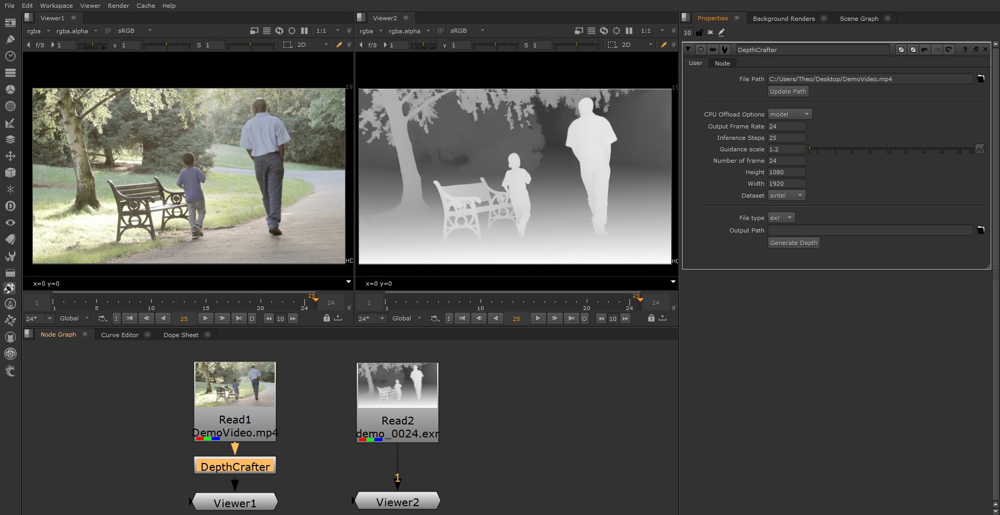

## ___***DepthCrafter for Nuke***___
<div align="center">

[Depthcrafter by TENCENT](https://github.com/Tencent/DepthCrafter)
<br><br>
Adapted for Nuke by 
<br><br>
[Theo SAMINADIN](https://github.com/Theo-SAMINADIN-td)

</div>
 <br><br>

DepthCrafter for Nuke allows you to generate temporally consistent Depth sequences inside Nuke. See more examples [here](https://github.com/Tencent/DepthCrafter?tab=readme-ov-file#-visualization)

<div style="display: flex;">
  
  <br><br>
</div>

https://github.com/user-attachments/assets/8038df8c-59b7-4a61-ad8b-9af4590e46dc

## 💡 Extra features

- EXR Sequence export
- DepthCrafter node


## 🗒️ Requirements
According to [Nuke v15 Third-Party Libraries and Fonts](https://learn.foundry.com/nuke/content/misc/studio_third_party_libraries.html)

- Nuke 15 or higher (not tested on previous versions)
- Python 3.10.10
<br><br>
## 🛠️ Installation
### 1. Clone this repo into your .nuke (by default C:\Users\\%UserProfile%\\.nuke) :
```bash
git clone https://github.com/Theo-SAMINADIN-td/NukeDepthCrafter.git
```
Or Download this repo as [ZIP file](https://github.com/Theo-SAMINADIN-td/NukeDepthCrafter/archive/refs/heads/main.zip) and extract it in your .nuke
<br><br>

Your tree should look like that
<br><br>
<div style="display: flex;">
  
  <br><br>
</div>

### 2. Download the [Model from Tencent HF page](https://huggingface.co/tencent/DepthCrafter/blob/main/diffusion_pytorch_model.safetensors) and put it in .nuke\DepthCrafterPlugin


### 3. Install Dependencies :

According to [Nuke v15 Third-Party Libraries and Fonts](https://learn.foundry.com/nuke/content/misc/studio_third_party_libraries.html)
<br>
<br>
<br>
Pytorch/Cuda and xformers
<br>
```bash
pip install torch==2.1.1+cu118 xformers --index-url https://download.pytorch.org/whl/cu118
```
Then
```bash
pip install -r requirements.txt
```
Refering to [requirements.txt](https://github.com/Theo-SAMINADIN-td/NukeDepthCrafter/blob/main/DepthCrafterPlugin/requirements.txt)

In init.py add your PATH. Check it by typing System Environment Variables in your start menu then click on Environment Variables and look for PATH.
```bash
nuke.pluginAddPath("path/to/your/PATH")
```
<br></br>
***❗If your .nuke folder path is not C:\Users\\%UserProfile%\\.nuke, please change the [unet_path](https://github.com/Theo-SAMINADIN-td/NukeDepthCrafter/blob/b79dcefdee3c9c872723a90ef2688cfd33c03022/nukedc.py#L47C3-L47C4) by adding yours***

# 👌 Launch Nuke !
